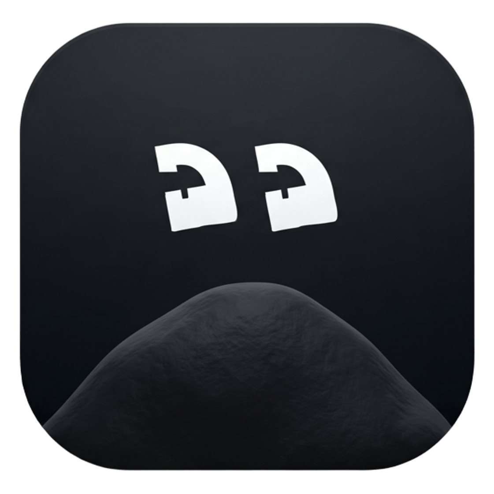

<div align="center">



# ❝ Quotal

### Ultra-fast, 100% Offline AI Voice Dictation for Windows
*Inspired by Wispr Flow. Built natively for Windows with local Whisper models, Hinglish romanization, and instant cursor paste.*

[](https://microsoft.com/windows)
[](https://python.org)
[](https://github.com/SYSTRAN/faster-whisper)
[](#-privacy--offline-first)
[](#-license)

</div>

---

## ⚡ What is Quotal?

**Quotal** is a private, latency-optimized speech-to-text dictation utility engineered specifically for Windows. Rather than sending your audio to cloud APIs, Quotal runs quantized Whisper models locally on your CPU or NVIDIA GPU.

Press and hold your hotkey, speak naturally, and release—the transcription is cleaned of hesitations and pasted directly at your cursor in any active app (VS Code, WhatsApp, Slack, Browser, Word, Notepad, etc.).

---

## ✨ Key Features

- **🎙️ Hold-to-Talk Workflow**:
  - Hold **Right Alt** (or **F8**) to record.
  - Release to automatically clean, enhance, and paste at the active caret position via Win32 `SendInput`.
- **🔮 WebGL Fluid Orb Overlay**:
  - Hardware-accelerated frosted glass floating pill inspired by modern desktop UX.
  - Per-pixel DWM transparency with zero black boxes or background artifacts.
  - **Repositionable & Draggable**: Click and drag the pill anywhere on your screen. Double-click to instantly snap back to bottom-center. Position is remembered across reboots.
  - Real-time voice amplitude equalizer and fluid color transitions between states (*Listening* ➔ *Enhancing* ➔ *Pasted*).
- **🔒 100% Offline & Private**:
  - Zero audio leaves your computer. No cloud accounts, tokens, or subscription fees required.
- **✨ Dual-Mode AI Text Enhancement (Choose your flavor in Settings)**:
  - ⚡ **Instant Fast (Rules)**: 0ms latency, zero RAM. Automatically strips hesitations, drops speech stutters, self-corrections (*"meet at 5, no wait, 6 pm"* ➔ *"meet at 6 pm"*), expands contractions, and fixes phonetic slang (*"badi"* ➔ *"buddy"*).
  - 🧠 **AI Neural Polish (Qwen 2.5 0.5B)**: Offline local LLM pass inspired by Wispr Flow. Automatically corrects complex grammar, reorganizes messy dictation, formats multi-step lists, and cleans conversational run-on speech.
  - ⚪ **Off**: Output raw Whisper dictation directly without modifications.
- **🧹 Deterministic Hesitation & Filler Removal**:
  - Deterministically removes filler vocalizations (*"um"*, *"uh"*, *"hmm"*, *"ah"*, *"er"*) while preserving genuine vocabulary (like Hindi *"hum"* or English *"err"*).
- **🇮🇳 Native Hinglish Support**:
  - Optional support for `Oriserve/Whisper-Hindi2Hinglish-Swift` locally on your GPU/CPU, outputting conversational Hindi directly in standard Latin/Roman script (*"aaj milte hai"*, *"theek hai, kal milenge"*).
- **🖥️ Hardware-Accelerated Modern Dashboard**:
  - Smooth Edge Chromium (WebView2) interface for reviewing dictation history, copying previous snippets, switching speech models & enhancement modes, and toggling system startup.
- **🪟 Windows Native Polish**:
  - **Standalone Executable**: Runs as native `Quotal.exe` with custom application branding and logo in Windows Task Manager (no generic Python process grouping).
  - **Silent Background Startup**: Runs as a pure GUI subsystem application—**zero command prompt or terminal windows** appear on Windows startup.
  - **System Tray**: Unobtrusive tray icon next to the clock with quick access to the dashboard and exit.

---

## 🏗️ Architecture

Quotal is structured into decoupled components communicating over local IPC sockets to guarantee transcription and UI never block each other:

```
┌─────────────────────────────────────────────────────────────┐
│                       Quotal Engine                         │
│                          (app.py)                           │
│  - Hardware Key Polling (Win32 GetAsyncKeyState)            │
│  - Audio Capture (sounddevice @ 16kHz)                     │
│  - Local Inference (faster-whisper / CTranslate2)          │
│  - Hesitation Cleaner & AI Enhancer                         │
│  - Win32 Cursor Paste Injection                             │
└──────────────┬──────────────────────────────┬───────────────┘
               │                              │
               ▼ Local IPC                    ▼ Subprocess IPC
┌──────────────────────────────┐ ┌──────────────────────────────┐
│       Quotal Dashboard       │ │     Floating Pill Host       │
│     (dashboard_host.py)      │ │      (web_pill_host.py)      │
│  - Edge Chromium (WebView2)  │ │  - Frameless Topmost Window  │
│  - History & Model Switcher  │ │  - WebGL Fluid Shader Orb    │
│  - Settings & Autostart      │ │  - Real-time Amplitude Wave  │
└──────────────────────────────┘ └──────────────────────────────┘
```

---

## 🚀 Detailed Setup Guide

### 1. Prerequisites

Before installing Quotal, ensure your system meets the following requirements:

- **Operating System**: Windows 10 (Build 19041+) or Windows 11 (64-bit).
- **Python**: Python **3.10, 3.11, or 3.12** (64-bit).
  - ⚠️ *Important*: During Python installation, ensure the checkbox **"Add python.exe to PATH"** is checked.
- **Microsoft Edge WebView2 Runtime**:
  - Pre-installed natively on Windows 11 and recent Windows 10 updates.
  - If missing on older Windows 10 installs, download the [Evergreen Bootstrapper from Microsoft](https://developer.microsoft.com/en-us/microsoft-edge/webview2/).
- **Microphone**: Any functional internal or external USB microphone.
  - Go to **Windows Settings > Privacy & security > Microphone** and ensure **"Let desktop apps access your microphone"** is switched **ON**.
- **Hardware & GPU (Optional, Recommended)**:
  - **CPU**: Runs smoothly on any modern multi-core processor (Intel Core i3/i5/i7/i9 or AMD Ryzen).
  - **GPU**: NVIDIA GPU (GTX 1060 / 1650 or higher, RTX series) with up-to-date NVIDIA drivers for sub-500ms dictation latency with CUDA `float16`. (Quotal automatically detects CUDA and seamlessly falls back to CPU if no NVIDIA card is present).

---

### 2. Step-by-Step Installation

#### Step 1: Clone or Download the Repository
Open PowerShell or Windows Terminal in your preferred projects folder:
```powershell
git clone https://github.com/<your-username>/Quotal.git
cd Quotal
```
*(Alternatively, download the ZIP archive and extract it to a folder such as `C:\projects\Quotal`)*.

#### Step 2: Create a Python Virtual Environment
Creating an isolated virtual environment guarantees no dependency conflicts:
```powershell
python -m venv .venv
.\.venv\Scripts\activate
```

#### Step 3: Install Required Dependencies
Install the required audio processing, CTranslate2, and GUI libraries:
```powershell
pip install -r requirements.txt
```
> **Tip for NVIDIA GPU Users**: `requirements.txt` includes `nvidia-cublas-cu12` and `nvidia-cudnn-cu12`. Quotal's engine automatically maps these packages directly to your Windows DLL path, enabling full CUDA acceleration without requiring manual CUDA Toolkit installation!

#### Step 4: Generate the Desktop Shortcut & Standalone Launcher
Run the built-in shortcut generator script to create a branded Desktop icon:
```powershell
python make_shortcut.py
```
This sets up:
1. `Quotal.lnk` on your Desktop with the high-resolution Quotal icon.
2. Directly launches `Quotal.exe` without opening command prompts or terminal windows.

---

### 3. Launching Quotal

You have multiple convenient ways to launch Quotal:

| Method | How to Launch | Behavior |
| :--- | :--- | :--- |
| **Direct Executable** *(Recommended)* | Double-click `Quotal.exe` in the root folder | Opens directly with zero console windows. Displays only `Quotal` in Task Manager. |
| **Desktop Shortcut** | Double-click the **Quotal** shortcut on your Desktop | Instant launch with custom icon. |
| **Startup Background** | Toggle **Start with Windows** in Dashboard Settings | Starts completely silently into the System Tray on Windows boot. |
| **Batch Launcher** | Double-click `run.bat` | Quick launcher script. |

---

### 4. First Run & Initial Model Download

1. When you start Quotal for the first time, it checks for your selected model in local storage.
2. If using **Whisper Base** or **Whisper Small**, it downloads the compact quantized model once from Hugging Face and caches it in `~/.cache/huggingface/hub/`.
3. Subsequent launches are **100% offline**—no internet connection is ever needed again.
4. The Quotal icon will appear in your **System Tray** (next to the clock), and the Dashboard window will open.

---

### 5. Using Dictation & Controls

1. **Focus any App**: Click into any text field (VS Code, Word, Chrome, Discord, WhatsApp, Slack, Terminal, etc.).
2. **Hold Hotkey**: Press and hold **Right Alt** (or **F8**).
   - The frosted glass **Floating Pill** will smoothly appear showing the dynamic WebGL audio waveform.
3. **Speak Naturally**: Talk clearly into your microphone.
4. **Release**: Release the hotkey.
   - The pill transitions to purple (*Enhancing*), then green checkmark (*Pasted*), and automatically vanishes.
   - Your speech is instantly cleaned of hesitations and pasted right at your cursor caret!
5. **Dragging the Pill**: You can left-click and drag the pill anywhere on your screen. Double-click it anytime to snap it back to default bottom-center.

---

### 6. AI Text Enhancer Configuration

From the **Quotal Dashboard**, navigate to the **Enhancement** section to select your preferred style:

- ⚡ **Instant Fast (Rules - 0ms latency)**:
  - Recommended default.
  - Deterministically removes vocal fillers (*"um"*, *"uh"*, *"hmm"*), drops self-corrections (*"let's meet at 5, wait no, 6"* ➔ *"let's meet at 6"*), and expands spoken abbreviations.
- 🧠 **AI Neural Polish (Local Qwen 2.5 0.5B LLM)**:
  - Deep grammar and structural restructuring model inspired by Wispr Flow.
  - Click **Download Model** directly inside the Dashboard (downloads the quantized 390 MB model locally).
  - Runs 100% locally on your machine with zero cloud calls.
- ⚪ **Off**:
  - Outputs raw verbatim Whisper transcriptions.

---

### 7. Frequently Asked Questions & Troubleshooting

<details>
<summary><b>Q: Why is Task Manager showing Quotal instead of Python?</b></summary>

Quotal uses a native compiled GUI binary (`Quotal.exe`) that executes Python in-process under the Windows GUI subsystem. This ensures Windows assigns all windows, tray icons, and background worker threads strictly to `Quotal`, showing the custom branding and icon without any generic Python grouping.
</details>

<details>
<summary><b>Q: How do I make Quotal start automatically with Windows?</b></summary>

Open the **Quotal Dashboard** by clicking the tray icon and toggle **Start with Windows** to **ON**. Quotal creates an entry in your Windows Startup folder that runs silently with `--silent`—zero command prompt or terminal windows will appear when your PC boots.
</details>

<details>
<summary><b>Q: Nothing gets transcribed when I release the key. What should I check?</b></summary>

1. **Microphone Permissions**: Open Windows Settings > *Privacy & security* > *Microphone*. Ensure desktop apps have permission to access your microphone.
2. **Default Input Device**: Right-click the speaker icon in your taskbar > *Sound settings* > verify that your desired microphone is set as the Default Input Device.
3. **Logs**: Check `quotal.log` in the project root folder for diagnostic messages.
</details>

<details>
<summary><b>Q: How can I change the trigger key from Right Alt?</b></summary>

Open `app.py` and modify lines 78-79:
```python
VK_RMENU = 0xA5    # Right Alt (Default)
VK_F8    = 0x77    # Alternative trigger
```
You can replace these with any Win32 Virtual Key code (for example, `0x14` for Caps Lock or `0x5B` for Windows key).
</details>

<details>
<summary><b>Q: How do I reset the floating pill position?</b></summary>

Simply double-click anywhere on the floating pill while it is visible, and it will immediately reset back to bottom-center. You can also edit `"pill_x": null, "pill_y": null` in `settings.json`.
</details>

---

## ⚙️ Configuration & Customization

All persistent settings are stored in `settings.json`:

```json
{
  "model_key": "base",
  "device": "auto",
  "ai_enhance": true,
  "enhancer_mode": "rules",
  "strip_hesitations": true,
  "audio_chimes": true,
  "pill_x": null,
  "pill_y": null
}
```

### Changing the Trigger Hotkey
Open `app.py` and modify the virtual key codes at lines 78-79:
```python
VK_RMENU = 0xA5    # Right Alt
VK_F8    = 0x77    # F8
```
You can replace them with any Win32 Virtual-Key Code (e.g., `VK_CAPITAL = 0x14` for Caps Lock).

---

## 📦 Project Structure

```
Quotal/
├── Quotal.exe            # Native Windows GUI launcher (zero console popup)
├── run.bat               # Simple batch launcher for Quotal.exe
├── launch_silent.vbs     # VBScript silent background starter
├── app.py                # Main backend dictation engine & key polling
├── audio_recorder.py     # Low-latency ring-buffered microphone stream
├── transcriber.py        # faster-whisper CTranslate2 model pipeline
├── cleaner.py            # Deterministic hesitation & vocal filler remover
├── smart_enhancer.py     # AI phonetic & punctuation polish pass (Rules + Qwen 2.5)
├── injector.py           # Win32 SendInput clipboard paste simulator
├── overlay_pill.py       # IPC controller for floating UI
├── web_pill_host.py      # WebView2 host for floating fluid pill with DWM transparency
├── pill.html             # WebGL GLSL fluid shader & equalizer UI
├── dashboard_host.py     # WebView2 host for management dashboard
├── dashboard.html        # Responsive HTML5/CSS3 dashboard interface
├── history_manager.py    # Local JSONL history storage
├── settings_manager.py   # User preferences manager
├── single_instance.py    # Local port-based single-instance lock & IPC
├── tray_manager.py       # pystray notification area integration
├── win_startup.py        # Windows Startup folder integration
├── make_shortcut.py      # Desktop .lnk generator with custom icon
├── requirements.txt      # Python dependencies
├── quotal_icon.png       # High-resolution app branding icon
└── quotal.ico            # Multi-resolution Windows application icon
```

---

## 🔒 Privacy & Offline First

- **Zero Cloud Dependencies**: All transcription and cleanup runs directly on your machine.
- **No Data Collection**: Dictation logs are stored exclusively in your local `history.jsonl` file. You can clear them anytime via the Dashboard.
- **Auditable**: Completely open-source Python implementation.

---

## 📄 License

This project is licensed under the [MIT License](LICENSE).
